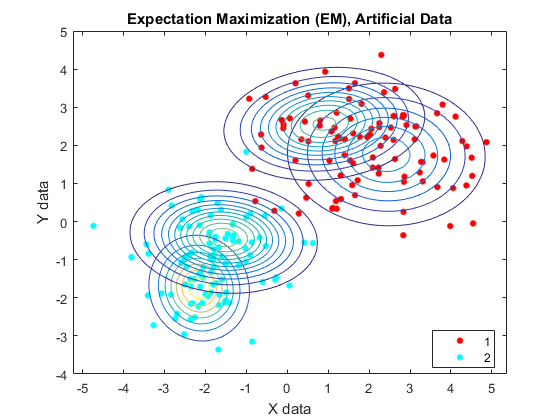

# Aprendizagem de Máquina

- Teoria da Decisão Bayesiana I 
- Teoria da Decisão Bayesiana II
- Estimação Paramétrica I
- Misturas I
- Tecnicas não-parametricas
- Combinação de Modelos
- Avaliação de Modelos
- Aprendizagem não Supervisionada e Clustering I
- Aprendizagem não Supervisionada e Clustering II
- Aprendizagem não Supervisionada e Clustering III

## Code
### [w1] Teoria da Decisão Bayesiana
### [w2] Misturas I

`[Mu,Sigma,PI] = EM(X, ng,  maxiter);`

## Bibliografía 
1. Duda, R. O., Hart, P. E. and Stork, D. G. Pattern Classification. John Wiley & Sons, 2001. 
2. C. M. Bishop. Pattern Recognition and Machine Learning, 2006
3. Andrew R. Web. Statistical Pattern Recognition
4. Johson, R.A., Wichern, D. W. Applied Multivariate Statistical Analysis. Prentice Hall, 1999 
